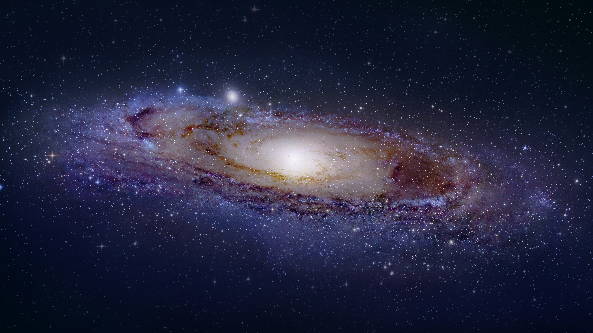

# COSE DA FIXARE

## generale

- [ ] inserisci comando per color picker xcolor
- [ ] capire come allungare il tempo della foto copiata a spectacle
- [ ] cambia file manager che fa cacare il cazzo, usa thunar
- [ ] se hai voglia, cambia tema bat (proprio perché non ho un cazzo da fare ceh)

## speedcrunch

- [x] done

## bspwm

- [ ] fai in modo che zathura si apra sempre in modalità fullscreen (copia emacs)
- [ ] cerca di fare xclip che incolli in automatico
- [ ] aggiorna bspwm con le barre polybar

## sddm

- [ ] considera di cambiare tema
- [ ] committa il tema

## grub

- [ ] mostra più caratteri di quelli che ora si vedono, che non posso manco leggere la versione del kernel

## emacs

- [ ] considera di cambiare l'immagine di doom (a dire il vero no so se si può fare kek)
- [ ] vedi se c'è un tema migliore per doom
- [ ] metti autosave
- [x] metti uno splash text
- [ ] prova a vedere se puoi cambiare leggermente la funzione
- [x] committa tutto
- [x] metti opacità all'85%
- [x] committa tutto

## zsh

## picom

- [ ] capire le animazioni come funzionano, e perché mo fa tutto più cagare
- [ ] considera di cambiare fork e vedi se ne vale la pena
- [ ] capire perché dopo la sospensione e anche dopo che lo schermo è andato in stand by (che non so è una cosa hardware o software) non si riavvia da solo
- [x] aggiungi bordi rounded
- [x] rimouvi blur da telegram CONTROLLA SE FIXATO
- [x] rimuovi blur da zoom CONTROLLA SE FIXATO

## betterlockscreen

- [ ] fai in modo che appaia dopo la sospensione

## polybar

- [ ] discord in call è più piccolo??
- [ ] fixa il bug dei giorni che hanno lunghezze diverse
- [ ] fixa il problema del volume allo 0-9% e al >= 100%
- [ ] fai anche audio del mic
- [ ] capisci se puoi togliere polybar quando vai in fullscreen mode (a dire il vero non so neanche se è un problema di polybar o di bspwm, da capire) NO PIÙ CHE ALTRO CAPIRE PERCHE OGNI TANTO LO FA E OGNI TANTO NO BOH (credo lo faccia solamente dopo che lo schermo è andato in stand by)
- [ ] aggiungi processi in background (tipo zoom o droidcam)

## dunst

- [ ] dunst fork per i bordi arrotondati credo, che palle
- [ ] autoelimina le notifiche automaticamente dopo un tot di tempo, da aggiungere e anche in fretta

## nvim

- [ ] cambia quella cosa fastidiosissima di coc
- [ ] cambia tema airline che deve matchare il resto ora

## rofi

- [ ] controlla cos'è quell'alone strano
- [ ] camba il tema accordingly, rifallo tutto
- [ ] cambia bordi
- [ ] aggiungi powermenu
